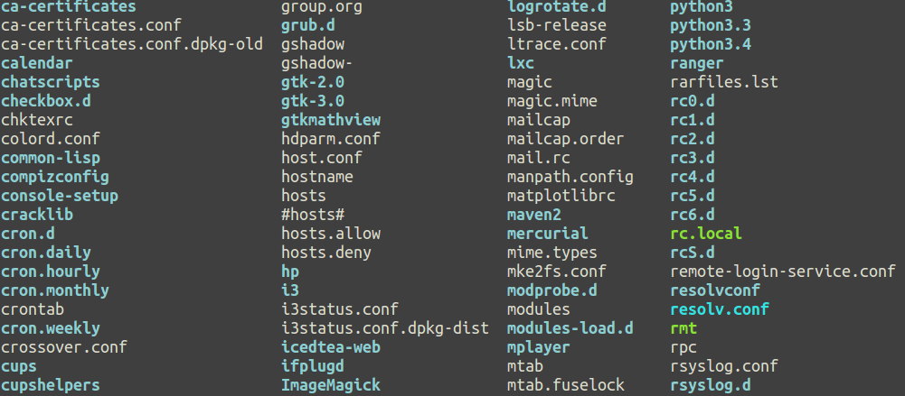

#说明
-----

一个类似Zenburn风格的Gnome终端主题，基于Zenburn风格之上做了一些配色修改，看起来更丰富一些。

#安装
-----

##1、克隆

    $ git clone https://github.com/1u4nx/gnome-terminal-similar-Zenburn.git
    $ cd gnome-terminal-similar-Zenburn

##2、运行安装脚本

    $ bash ./gnome-terminal-similar-Zenburn.sh

*注意：目前脚本只支持Bash，Zsh会出错，请用Bash执行*

如果想覆盖当前的Gnome终端主题，选择`Default`即可。
